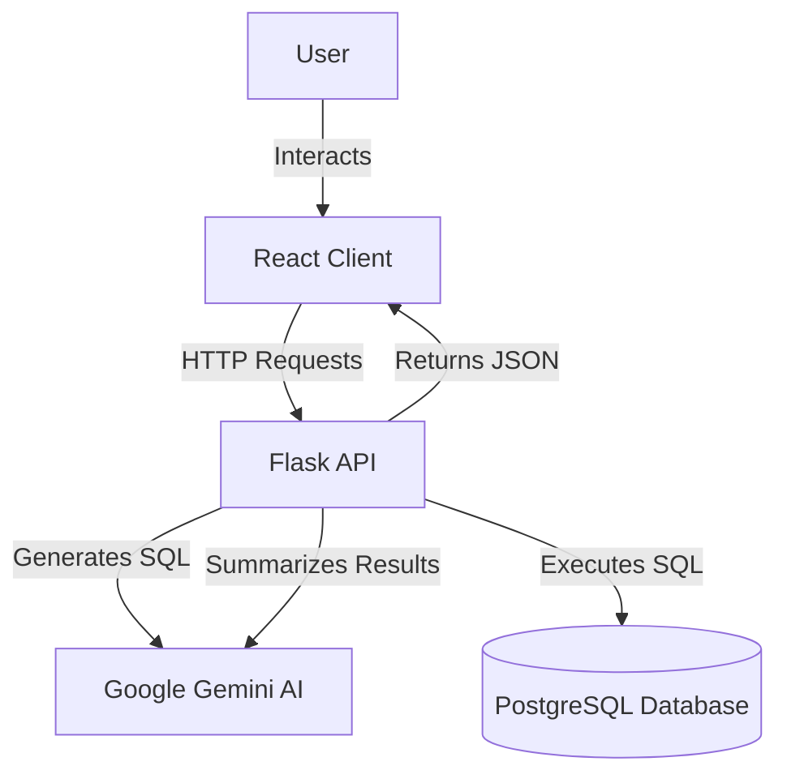
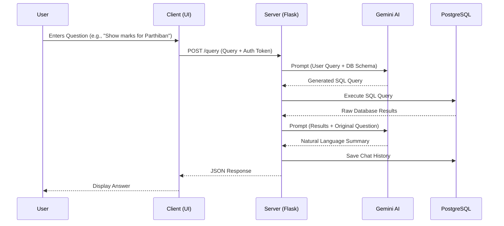

# SQL Chatbot

A powerful full-stack application that bridges the gap between natural language and SQL databases. This project enables users to query a PostgreSQL database using everyday language, powered by Google's Gemini AI.

## 🚀 Features

- **Natural Language to SQL**: Converts user questions into complex SQL queries automatically.
- **Intelligent Summarization**: Explains database results in easy-to-understand natural language.
- **Secure Authentication**: JWT-based user authentication system.
- **Conversation History**: Tracks and stores user query history for context.
- **Robust Architecture**: Built with Flask (Python) and React (Vite).

---

## 🏗️ Architecture

The application follows a modern client-server architecture:



### Components
- **Frontend**: React.js driven by Vite for a fast, responsive UI. Uses Tailwind CSS for styling.
- **Backend**: Flask server acting as the orchestrator between the database and the AI model.
- **Database**: PostgreSQL storing the business data (`students`, `subjects`) and chat history.
- **AI Engine**: Google Gemini 1.5 Flash model for natural language understanding and generation.

---

## 🔄 System Flow

The core workflow of processing a user query is as follows:



---

## 📊 Data Flow

1.  **User Input**: The user inputs a text string via the React frontend.
2.  **API Transport**: The query, along with the user's JWT token, is sent to the backend endpoint `/query`.
3.  **SQL Generation**: The backend constructs a prompt containing the database schema and the user's query, sending it to Gemini.
4.  **Database Interaction**:
    *   The generated SQL is validated and executed against the PostgreSQL database.
    *   `students` and `subjects` tables are queried.
5.  **Response Generation**: The raw data (e.g., list of marks) is sent back to Gemini to generate a human-readable summary.
6.  **Persistence**: The conversation pair (query + response) is stored in the `chatbot_history` table.
7.  **Presentation**: The final text response is sent to the frontend for display.

---

## 📂 Folder Structure

```
/sql_chatbot
├── client/                 # Frontend React Application
│   ├── public/             # Static assets
│   ├── src/                # Source code (Components, Pages, etc.)
│   ├── .gitignore
│   ├── index.html
│   ├── package.json        # Frontend dependencies
│   ├── tailwind.config.js  # Tailwind styling config
│   └── vite.config.js      # Build tool config
├── server/                 # Backend Flask Application
│   ├── .env                # Environment variables (secrets)
│   ├── server.py           # Main API application entry point
│   ├── user-add.py         # Script to create admin/users manually
│   └── requirements.txt    # Backend dependencies
└── README.md               # Project documentation
```

---

## 🛠️ Setup & Installation

### Prerequisites
- Node.js & npm
- Python 3.8+
- PostgreSQL
- Google Gemini API Key

### 1. Database Setup
Ensure PostgreSQL is running and create a database (e.g., `sql_chatbot`). Run the following SQL commands to set up the required tables:

```sql
-- Users Table
CREATE TABLE users (
    id SERIAL PRIMARY KEY,
    email VARCHAR(255) UNIQUE NOT NULL,
    password VARCHAR(255) NOT NULL
);

-- Chat History Table
CREATE TABLE chatbot_history (
    id SERIAL PRIMARY KEY,
    user_id INTEGER REFERENCES users(id),
    conversation_id VARCHAR(255),
    title VARCHAR(255),
    user_query TEXT,
    nl_response TEXT,
    created_at TIMESTAMP DEFAULT CURRENT_TIMESTAMP
);

-- Students Table (Example Schema)
CREATE TABLE students (
    id TEXT PRIMARY KEY,
    roll_no TEXT,
    name TEXT,
    dept TEXT,
    mailid TEXT,
    sem TEXT,
    year INTEGER,
    speciallab TEXT
);

-- Subjects Table (Example Schema)
CREATE TABLE subjects (
    id SERIAL PRIMARY KEY,
    exam_name TEXT,
    course_code TEXT,
    student_id TEXT REFERENCES students(id),
    subject_name TEXT,
    total_mark INTEGER
);
```

### 2. Backend Setup
Navigate to the server directory:
```bash
cd server
```

Create a virtual environment and install dependencies:
```bash
python -m venv venv
# Windows
venv\Scripts\activate
# Mac/Linux
source venv/bin/activate

pip install -r requirements.txt
```

Create a `.env` file in the `server/` directory. **Do not commit this file to version control.**
```env
# Server Configuration
GEMINI_API_KEY=your_gemini_api_key_here
DB_NAME=your_db_name
DB_USER=your_db_user
DB_PASSWORD=your_db_password
DB_HOST=localhost
DB_PORT=5432
SECRET_KEY=your_secure_random_key
```

Run the server:
```bash
python server.py
```

### 3. Frontend Setup
Navigate to the client directory:
```bash
cd ../client
```

Install dependencies and run the development server:
```bash
npm install
npm run dev
```

The application should now be accessible at `http://localhost:5173`.

---

## 🔒 Security

- **Environment Variables**: Sensitive keys (API keys, DB credentials) are stored in `.env` files and strictly excluded from git.
- **Authentication**: All protected endpoints require a valid JWT token.
- **SQL Injection Safety**: While the AI generates SQL, the system uses read-only connections where possible or strictly controlled execution environments (Note: Ensure the DB user has appropriate permissions).

## 📝 License
This project is open-source and available under the MIT License.
